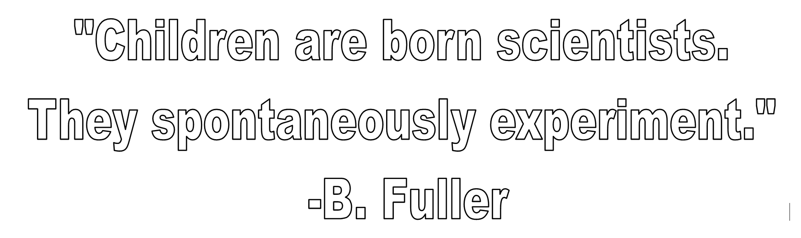
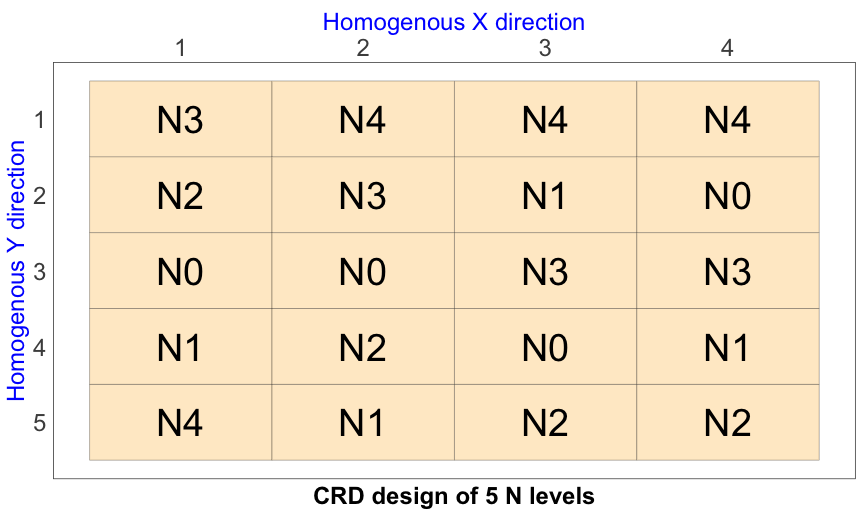
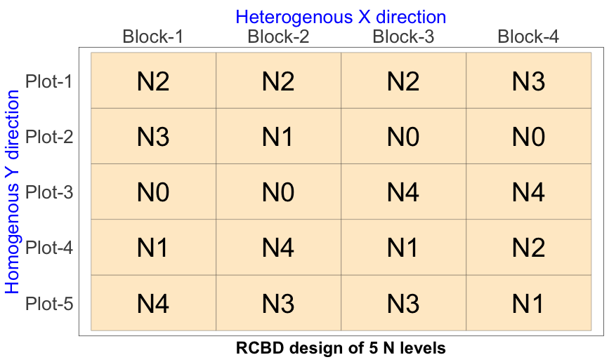
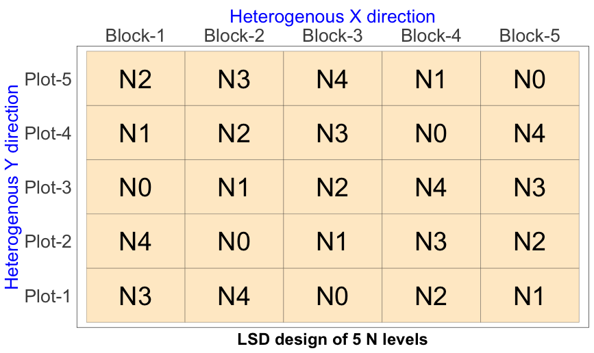
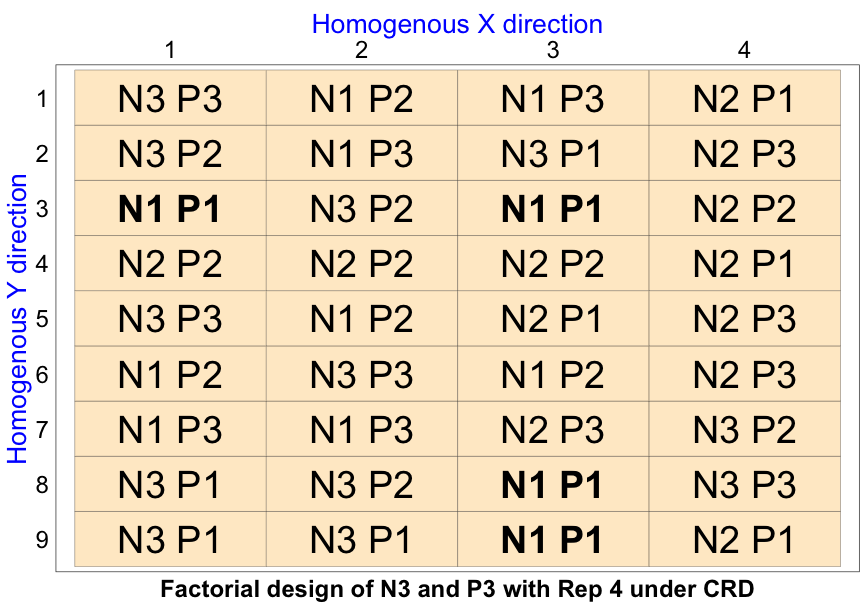
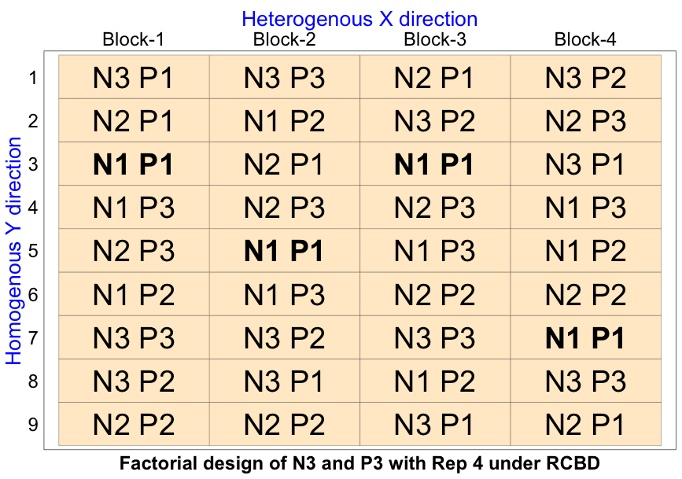
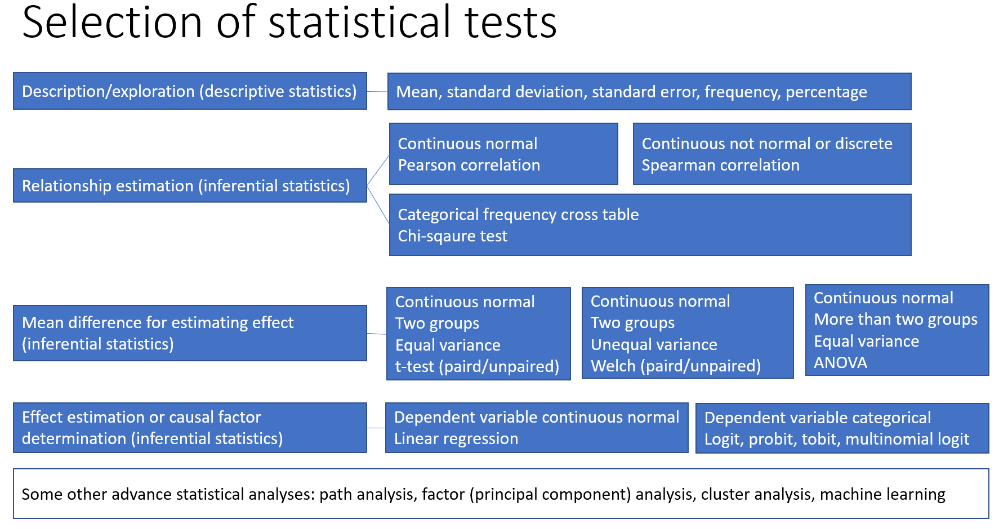
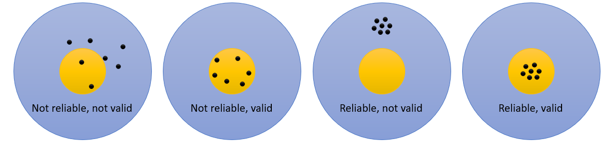

### Presentation link: Scan

{fig-align="center"}

## Research and Knowledge

- Knowledge is the stored information in our brain, books or internet that can be recalled when needed.
- Source of knowledge can be anything and anywhere.
- Knowdge generated using systematic (scientific) process is called science.
- Expression of science is technology. e.g. idea, practice, device, sofware, etc. 

{fig-align="center"}

## Research Types

- **Fundamental research:** to generate new knowledge (theory) or test existing theory. Fundamental research conducted to investigate the cause-effect relationship between variables is called **experimental research**.
- **Applied research:** to solve a specific problem using existing (indigenous/scientific) knowledge.
- **Action research:** applied research with a focus on immediate application in a local context.
- **Behavioral research:** to understand human/social behavior. e.g. perception, attitude, motivation, adoption, participation, training effectiveness, adaptation to climate change, etc.

## Research Terminologies

- **Reserch methodology:** ~ How to conduct research?
- **Research method:** ~ A specific way to collect and analyze data.
- **Research design:** ~ A plan to conduct research. e.g. qualitative, quantitative, mixed method, experimental design, etc.
- **Experiment:** ~ A trial or setup involving treatments/interventions and experimental units.
- **Experimental design:** ~ A plan to apply treatments/interventions in an experiment. e.g. CRD, RCBD, Factorial, pretest-posttest control group design, timeseries design, etc.

## Steps in Research

1. Problem identification
2. Setting research objectives
3. Specififying research methodology
4. Data collection and analysis
5. Intrepretation and conclusion

> Every step includes: Literature review

> Ends the step with: Scientific report writing (presentation/publication)

## Data to Law {.smaller2}

- **Data: **Raw and unprocessed information (numbers, text, images, etc.). e.g. 20, 30, 40, etc.
- **Information:** Processed data with meaning. e.g. 20°C is the average temperature in April.
- **Fact: **Verifiable information. e.g. Water boils at 100°C.
- Evidence: Information that supports or refutes a claim. e.g. observed increase in crop growth with row planing.
- **Hypothesis:** A testable scientific guess about the relationship between variables. e.g. row planing enhances crop growth.
- **Theory:** Proven hypothesis. e.g. balannce fertilizer is better than imbalanced fertilizer for crop growth.
- **Law:** Proven theory with universal applicability. e.g. Law's of learning: readyness, exercise, effect, etc.

## Problem Identification

- **Problem:** A gap between what is and what should be.
- Problem is the guiding force of research. This ensures research quality and resource allocation.
- **Sources of problem:** literature review, and personal experience, observation, discussion with stakeholders, etc. also linked to the exsisting literature.

> Problem must be consistent with the existing knowledge.

> Problem must have newness (innovativeness/novelty).

## Resarech Title and Objectives {.smaller1}

- **Title:** 10 - 15 words that reflect the research problem and objectives. Sometimes, it may include methodological aspects.
- **Example:** "Effect of row planing on growth and yield of wheat in Bangladesh", "Effect of training on income generation: A socio-psychological analysis using Kirkpatrick's model".
- Titles should avoid dead words (investigate, study, effect, etc.), colon (as in the avove example) and abbreviations.
  
- **Objectives:** Specific statements that describe what the research aims to achieve. 
- **Example:** To estimate the effect of training on the adoption of row planing among wheat farmers in Barishal region by the end of 2025.

## Research Design: CRD, RCBD, LSD, Factorial {.smaller1}

- **CRD:** One factor design where all units are homogeneous
  
{fig-align="center"}

---

### RCBD

- One factor design where field is homogeneous in one direction but heterogeneous in another direction. 

{fig-align="center"}

---

### LSD

- One factor design where the field is heterogeneous in both directions. 

{fig-align="center"}

---

### Factorial Design

- Two factors or treatments and both are easy to manage or manipulate.
- For example, effect of N and P on rice yield.
- This design can follow any of the basic designs.

---

### Factorial Design under CRD

{fig-align="center"}

---

### Factorial Design under RCBD

{fig-align="center"}

---

### Social Research Design

**A. Pre-experimental design:** no randomization. e.g. one group pretest-posttest design, one group posttest only design, static group comparison design (posttest only with control group)

**B. True experimental design: **randomization is possible and there is a control group. e.g. pretest-posttest control group design, posttest only control group design

**C. Quasi-experimental design:** randomization is not possible but there is a control group. e.g. non-equivalent control group design (has pretest), time series design

## Scales of Measurement

- MCQ
- Likert scale
- Rating scale
- Semantic differential scale
- Sentence completion
- Open ended questions
- Ranking items
- Pairwise ranking
- Multidimensional scaling

## Levels of Measurement {.smaller1}

- **Nominal:** categories without order
  - e.g. gender, religion, occupation, etc.
- **Ordinal:** categories with order
  - e.g. education level, income group, etc.
- **Interval:** numerical values without a true zero
  - e.g. temperature in Celsius or Fahrenheit
- **Ratio:** numerical values with a true zero
  - e.g. height, weight, age, income

> The level of measurement determines the appropriate statistical analysis and interpretation of data.

## Statements for Likert Scale

**Example:** "I am satisfied with the training program on row planing for wheat farmers in Barishal region."

**Response:** 

- Strongely agree = 5, 
- Agree = 4, 
- Neutral = 3 [no opinion or undecided], 
- Disagree = 2, 
- Strongly disagree = 1

## Constructing Statements

- Use present-tense, non-factual, and unambiguous statements relevant to the psychological construct.
- Keep statements short (under 20 words) and express one idea only.
- Use simple, clear, and direct language; avoid complex vocabulary.
- Avoid universal terms and double negatives (e.g., all, always, none, never).
- Use qualifiers sparingly (e.g., only, just, merely).
- Ensure balanced coverage across the affective scale; avoid statements most or few would endorse.

## Population and Sampling {.smaller2}

- **Population:** The entire group of individuals or items that meet certain criteria and are of interest in a research study. e.g. all wheat farmers in Barishal region.
- **Sample:** A subset of the population that is selected for participation in a research study. e.g. 100 wheat farmers from Barishal region.
- **Sampling:** The process of selecting a sample from the population.
- **Sampling frame:** A list or database of the population from which the sample is drawn. e.g. list of wheat farmers in Barishal region.
- **Sampling unit:** The individual or item that is selected for inclusion in the sample. e.g. a wheat farmer in Barishal region.
- **Sampling error:** The difference between the sample statistic and the population parameter due to random sampling

## Sampling Methods {.smaller2}

- **Probability sampling:** Each member of the population has a known and non-zero chance of being selected. e.g. simple random sampling, systematic sampling, stratified sampling, cluster sampling.

- **Non-probability sampling:** The probability of selection is unknown or zero for some members of the population. e.g. convenience sampling, purposive sampling, snowball sampling, quota sampling.

> In cluster sampling a number of clusters are randomly selected for data collection.

> In quota sampling quotas are set for different subgroups and data is collected until the quotas are filled.  

## Data Collection Methods/Tools {.smaller2}

- **Observation:** A method of data collection that involves systematically watching and recording behavior or events.
- **Questionnaire:** A set of written questions used to collect data from respondents. e.g. structured questionnaire, semi-structured questionnaire, unstructured questionnaire.
- **Interview:** A method of data collection that involves direct interaction between the researcher and the respondent. e.g. structured interview, semi-structured interview, unstructured interview.
- **Case study:** An in-depth analysis of a single case or a small number of cases. e.g. a village, a farm, a farmer, etc.
- **FGD, KII:** Focus Group Discussion and Key Informant Interview
- **PRA:** Transect walk, social mapping, wealth ranking, preference ranking, venn diagram, etc.

## Conducting Interviews {.smaller2}

- **Prepration: **interview schedule/questionnaire, date and time, venue, **consent** etc.
- **Rapport building:** establish trust and comfort with the respondent.
- **Data collection:** ask questions, listen actively, and record responses accurately.
  - Use probes and follow-up questions to clarify and expand responses.
  - Avoid leading questions and bias in data collection.
  - Ensure ethical considerations such as informed consent, confidentiality, and respect for the respondent's rights.
  - Never miss any questions and never guess any answers.
- **Closing:** thank the respondent and provide any necessary information about the next steps.

## Data Processing and Analysis

> **Remember:** Field editing and central editing are part of data processing.

- **Data processing:** The steps taken to prepare raw data for analysis, including data cleaning, coding, and organization.

- **Data analysis:** The application of statistical or qualitative techniques to interpret and draw conclusions from processed data. e.g. descriptive statistics, inferential statistics or hypothesis testing, thematic analysis, content analysis, etc.

- **Software for data processing and analysis:** MS Excel, OnlyOffice, R, Python, SPSS, Stata, MATLAB, Minitab, NVivo, etc.

## Selection of Statiscal Test

{fig-align="center"}

## Hypothesis and Errors

- **Null and Research Hypothesis:** Null hypothesis (H0) is a statement of no effect or no relationship, while research hypothesis (H1) is a statement of an expected effect or relationship.
- **Type I Error:** Rejecting a null hypothesis when it is true.
- **Type II Error:** Not rejecting a null hypothesis when it is false.

## Error Types

| Decision   | H~0~ is True     | H~0~ is False    |
|------------|------------------|------------------|
| **Reject** | Type I Error     | Correct Decision |
| **Accept** | Correct Decision | Type II Error    |

## Validity and Reliability

- **Validity:** The extent to which a research instrument measures what it is intended to measure. e.g. content validity, construct validity, criterion validity, etc.

- **Reliability:** The consistency and stability of a research instrument over time and across different conditions. e.g. test-retest reliability, inter-rater reliability, split-half or internal consistency reliability, etc.

{fig-align="center"}

## Data Types {.smaller3}

- **Quantitative data:** Numerical data that can be measured and analyzed statistically. e.g. height, weight, income, etc.
  - **Discrete data:** Quantitative data that can only take specific values. e.g. number of children, number of rows, etc.
  - **Continuous data:** Quantitative data that can take any value within a range. e
- **Qualitative data:** Non-numerical data that can be analyzed thematically or content-wise. e.g. interview transcripts, field notes, etc.

{fig-align="center"}

## Report Writing and Presentation

- To be contiued in the next session.
- Link: [https://ruenresearch.com/blogs/scientific-writing.html#/title-slide](https://ruenresearch.com/blogs/scientific-writing.html#/title-slide)

- Scan and go through the presentation and resources for the next session.

{fig-align="center"}