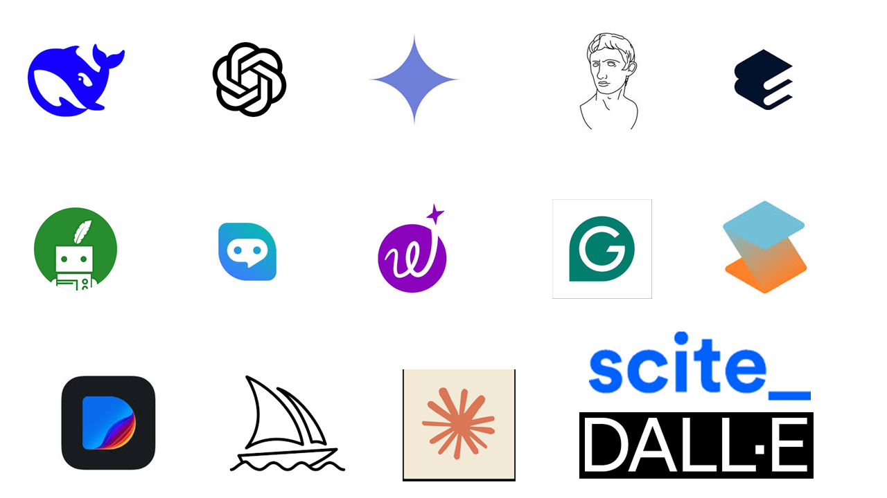
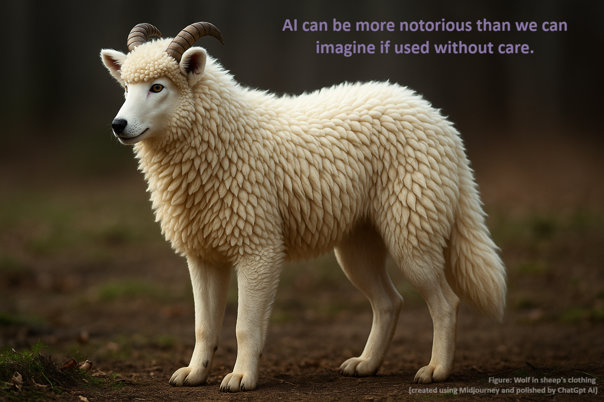

### Presentation link: Scan

{fig-align="center"}


## Why Scientific Writing and Publication? {.smaller2}

- To disseminate research findings to the scientific community, the public, donors, and policymakers.
- Publish or persish

> Scientific report writing = scientific communication = scientific publication

**Forms of Scientific Communication**

- **Thesis/dissertation:** Detailed research work presenting original findings.
- **Journal articles:** Original research, review articles, case studies, etc.
- **Books and book chapters:** Monographs, edited volumes, etc.
- **Conference papers:** Proceedings, abstracts, etc.
- **Policy briefs and reports:** For policymakers, donors, and practitioners.


## Formats of Scientific Writing {.smaller1}

- **Preliminaries:** Coverpage, title, authors, declaration, acknowledgements (just before the references in a journal article), abstract, keywords
- **Main body:** Introduction and Literature review, Methodology,  Results, Discussion, Conclusion
- **References:** List of cited sources in a specific citation style (e.g. APA, MLA, Chicago, etc.)
- **Appendices:** Supplementary materials (e.g. questionnaires, data, long tables, etc.)

## Preliminaries {.smaller2}

- **Title:** Should be concise, informative, and reflective of the content of the paper.
- **Authors:** List of contributors to the research work, along with their affiliations and contact information.
- **Abstract:** A brief summary of the research work, including the research question, methodology, key findings, and implications.
- **Keywords:** A list of relevant terms that help in indexing and searching for the paper.

> Preliminaries are included in the beginning of the report, but they are written at the end of the writing process. They are the last part of the report to be written.


## Introduction and Literature Review {.smaller2}

- Introduction means introducing the research problem and objectives. 
- Introduction covers literature review in a journal article.
- Introduction contains the following sections:
  - **Background:** Context and rationale for the study. General to specific contexts.
  - **Problem statement:** Clear and concise statement of the research problem based on literature and research gaps, practical needs or methodological gaps.
  - **Research objectives:** Specific goals that the study aims to achieve.
  - **Significance/novelty of the study:** Importance and potential impact of the research to the scientific community, practitioners, policymakers, and society at large.


## Literature Review

- **Definition:** A critical summary and synthesis of existing research on a specific topic.
- **Purpose:** To identify research gaps, justify the research problem, and provide a theoretical/conceptual framework for the study.
- **Conceptual framework:** A set of interrelated concepts, definitions, and propositions that present a systematic view of phenomena by specifying relations among variables.

## Methodology

- **Location**: Where the study was conducted (e.g. country, region, city, village, etc.) with their geophysical and socio-economic characteristics.
- **Design**: The overall approach and strategy used to conduct the study (e.g. experimental, observational, mixed methods).
- **Participants/Sample**: The individuals or groups involved in the study, including inclusion and exclusion criteria.
- **Sampling method**: The technique used to select participants or samples (e.g. random sampling, purposive sampling, convenience sampling).

## Methodology (cont'd)

- **Variables**: The factors or characteristics that are measured, manipulated, or controlled in the study.
- **Data Collection**: The methods and tools used to gather data (e.g. surveys, interviews, experiments).
- **Data Analysis**: The techniques used to analyze the collected data (e.g. statistical analysis, thematic analysis).

## Results

- **Presentation**: Use of tables, figures, and text to present the findings clearly and concisely.
- **Interpretation**: Explanation of the findings in relation to the research objectives and hypotheses.

> Repetition of results in the text, figures, and tables should be avoided. Results should be presented in a logical order, often following the sequence of the research objectives or hypotheses.

## Tables

- **Title:** A brief description of the content of the table, placed above the table.
- **Contents:** Organized in rows and columns, with clear labels for each row (stub) and column (header).
- **Footnotes:** Additional information, sources or explanations related to the table content.


## Guidelines for Tables {.smaller2}

- Use tables to present numerical data, comparisons, or categorical data that cannot be easily described in text.
- Avoid overcrowding tables with too much information; keep them simple and focused on key findings
- Avoild ditto marks.
- Keep comparing columns side by side.
- Keep total columns at the end of the table.
- Avoid vertical lines and use horizontal lines only to separate the header and the body of the table.
- Use consistent formatting and alignment for numbers and text in the table.


## Guidelines for Figures

- Use figures to present trends, patterns, relationships, or distributions that are difficult to describe in text or tables.
- Ensure that figures are clear, well-labeled, and appropriately scaled.
- Include a descriptive caption below the figurethat explains the content and significance of the figure.
- Make the figure self-explanatory, so that it can be understood without referring to the text.

## Interpretation of Results

- Interpret what has been found in relation to the research objectives and hypotheses.
- Highlight the interesting points and patterns in the results.
- Explain the points that are not understandable from the tables and figures.
- Present the results objectively without bias or over-interpretation.


## Discussion

- **Purpose:** To interpret the results, explain their implications, and relate them to existing supporting/contradictory literature and theories.
- **Content:** Explanation of the findings, comparison with previous studies, discussion of the implications for theory and practice, and acknowledgment of the limitations of the study.

> **Results** present **What** and **Discussion** explains **Why and how**. 


## Conclusion {.smaller1}

- **Purpose:** To summarize the main findings, restate the significance of the study, and provide recommendations for future research and practice.
- **Conclusion** answers **'So What'** of the research work. It should be concise and focused on the key takeaways from the study.
- It should not introduce new information or findings that were not discussed in the results and discussion sections.
- It should not contain references to literature or citations.
- Conclude only what is supported by the results and discussion sections. Avoid overgeneralization or speculation beyond the scope of the study.
- Include recommendations for policymakers, users, practitioners and future researchers based on the findings of the study.


## References

- **Citations: **
- 
  - Direct citations - in-text citations that are part of the sentence.
  - Indirect citations - in-text citations used inside parentheises in the sentences.

- **Reference: **A list of all sources/citations cited in the paper, formatted according to a specific citation style (e.g. APA, MLA, Chicago, etc.)

> **Software:** Use [**Mendeley**](https://www.mendeley.com/download-reference-manager/windows) (free), [**Zotero**](https://www.zotero.org/download/) (free), or [**Endnote**](https://endnote.com/downloads/) (paid) reference manager for managing and changing styles.

## Examples of Citations

Climatic impacts on agriculture are inevitable. El Niño Southern Oscillation itself, through droughts and floods, can cause 15 to 35% variation in global yield in wheat, oilseeds and coarse grains (Howden et al. 2007). Habiba et al. (2012) and Roy et al. (2018) conducted research in the drought-prone areas of Bangladesh.

## Examples of References {.smaller1}
  
::: hanging-indent

Habiba, U., Shaw, R., & Takeuchi, Y.
(2012).
Farmer’s perception and adaptation practices to cope with drought: perspectives from northwestern Bangladesh.
*International Journal of Disaster Risk Reduction, 1,* 72–84.
[https://doi.org/10.1016/j. ijdrr.2012.05.004](https://doi.org/10.1016/j.%20ijdrr.2012.05.004)

Howden, S.M., Soussana, J.F., Tubiello, F.N., Chhetri, N., Dunlop, M., & Meinke, H.
(2007).
Adapting agriculture to climate change.
*PNAS* 104, 19691–19696.
<https://doi.org/10.1073/pnas.0701890104>

Roy, D, Kowsari, M.S., Nath, T.D., Taiyebi, K.A., & Rashid, M.M.
(2018).
Smallholder farmers’ perception to climate change impact on crop production: case from drought prone areas of Bangladesh.
*International Journal of Agricultural Technology, 14*, 1813–1828

:::


## Reference Materials {.smaller2}

-   Books: author(s), year, title, publisher, place
-   Journal articles: author(s), year, title, journal, volume (issue): page, doi (digital object identifier) number
-   Newspaper articles: author(s), year, title, newspaper, publication date
-   Conference proceedings: authors(s), year, title, conference, date, page
-   Chapter of an edited book: author(s), year, chapter title, editors, book title, page, publisher, place
-   Webpage: authors(s), year, title, access date, web address
-   Anonymous (n.d.) when author and year are unavailable.
-   Anonymous (2021) when only author is unavailable.
-   Hasan et al. (n.d.) when only date is unavailable.


## Plagiarism and AI in Research

- Plagiarism is the inclusion of someone else ideas, text and results without acknowledgment is unethical and punishable academic crime.
- Use quote or paraphrased statements with proper citations of the original authors (even for your own previous works) to avoid plagiarism.
- The Turnitin software is used to detect plagiarism.
- gpt.me is used to detect AI-generated text.

> For details please visits [https://ruenresearch.com/blogs/ai-use.html](https://ruenresearch.com/blogs/ai-use.html)


## AI Tools in Research and Report Writing

- ChatGPT, Google Bard, Deepseek, Perplexity, Scispace, Elicit, Thesis.ai, DALL-E, Midjourney, Grammarly, Wordtune, Quillbot, etc.

{fig-align="center"}

## Paraphrase for Responsible Use of AI {.smaller2}

**AI-Generated Text:**

> "The uptake of novel agricultural technologies depends on a complex combination of socioeconomic conditions, access to extension services, and farmers' perception of risk."

**Human Paraphrase after checking the sources:**

> "The adoption of agricultural innovations depends on a complex set of socioeconomic attributes, access to extension services, and farmers' perception of risk."

**Why it is responsible?** The AI has generated the texts. The author has checked the sources and found ok followed by paraphrasing aligned with the standard format for publication.


## Responsible Paraphrasing {.smaller2}

**Original (Human-Written) Sentence:**

> "The adoption of new agricultural technologies is contingent upon a complex interplay of socioeconomic factors, extension service accessibility, and perceived risk among the farming community."

**AI-Assisted Paraphrase (using Quilbot/Hixbypass/Wordtune/Grammarly Suggestion):**

> "The uptake of novel agricultural technologies depends on a complex combination of socioeconomic conditions, access to extension services, and farmers' perception of risk."

**Why it is responsible?** The *idea* and *core content* are of the researcher. The AI has only helped with *word choice* and *sentence fluency*.

## Areas of Use of AI in Research {.smaller1}

Using AI in academic writing and research (Khalifa and Albadawy, 2024): 

- Idea generation and conceptualization
- Content structuring
- Literature review and synthesis
- Research design and methodology
- Data management including visualization
- Editing and grammar corrections
- Reference management

::: hanging-indent

Khalifa, M., & Albadawy, M. (2024). Using artificial intelligence in academic writing and research: An essential productivity tool. *Computer Methods and Programs in Biomedicine Update, 5,* 100145.

:::


---

<div style="text-align: center;">

</div>


## Danger in AI Use

<br>

```{mermaid}
%%| echo: false
%%{init: {'themeVariables': { 'fontSize': '2rem'}}}%%
graph LR
A[AI] --> B[Not using] --> C[Foolish]
A --> D[Blind use] --> E[Risky and dangerous]
A --> F[Responsible use] --> G[Your ethical standard]
```


## See you in another session. {.unnumbered}

<div style="text-align: center;">
<div style="font-size: 5rem;">
Thank you.
</div>

{width="300px" height="auto"}

Email: [kamrulext@pstu.ac.bd](mailto:kamrulext@pstu.ac.bd)

GSM/WhatsApp: +8801891565856

<div class="footer" style="font-size: small;">
Slides created using Quarto. Available at: [www.ruenresearch.com](www.ruenresearch.com)
</div>
</div>
